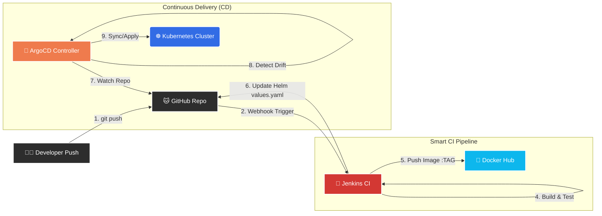

```markdown
# 🚀 GitOps-Driven Microservices E-Commerce Platform

> A production-grade **Microservices Architecture** orchestrated via **Kubernetes**, automated with **Jenkins**, and managed declaratively using **ArgoCD (GitOps)**.

## 🏗️ Architectural Workflow

This diagram illustrates the **Full GitOps Cycle**: from a code commit to a live update in the cluster, with zero manual intervention.



## 🌟 Key Features

### 1. **True GitOps Workflow**

* The cluster state is 100% defined in Git.
* **ArgoCD** acts as the continuous supervisor. If any resource is manually deleted in the cluster, ArgoCD automatically **Self-Heals** and restores it.

### 2. **Smart CI Pipeline (Jenkins)**

* **Conditional Builds:** The pipeline uses `changeset` logic to detect which microservice folder was modified. It **only builds the changed service**, saving significant CI resources and time.
* **Automated Versioning:** Jenkins dynamically updates the **Helm Chart** `values.yaml` with the new `${BUILD_NUMBER}` tag using `sed` and pushes the change back to Git with a `[skip ci]` flag to prevent infinite loops.

### 3. **Dynamic Infrastructure (Helm)**

* Replaced repetitive static YAML manifests with a single **Helm Chart**.
* Utilized **Loops (`range`)** and **Scoping (`$`)** to generate deployments for 4 services (Home, About, Contact, Services) from a single template.

### 4. **Production-Ready Resilience**

* **Liveness Probes:** Restart containers if the application deadlocks.
* **Readiness Probes:** Prevent traffic flow until the service is fully loaded.
* **Startup Probes:** Handle slow-starting legacy components.
* **Resource Limits:** CPU/Memory quotas enforced to prevent noisy neighbor issues.

## 🛠️ Tech Stack

| Component | Technology | Description |
| --- | --- | --- |
| **Source Control** | GitHub | Monorepo hosting Application Code & Helm Charts |
| **CI Server** | Jenkins | Automates Build, Test, Push, and Git Tagging |
| **Containerization** | Docker | Packaging microservices into lightweight images |
| **Registry** | Docker Hub | Storing versioned artifacts |
| **Templating** | Helm | Managing Kubernetes manifests dynamically |
| **CD / GitOps** | ArgoCD | Synchronizing Git state to the Cluster |
| **Orchestrator** | Kubernetes | Managing Pods, Services, and Ingress |
| **Ingress** | Nginx | Path-based routing (`/home`, `/about`, etc.) |

## 📂 Project Structure

```bash
microservices-ecommerce/
├── 📂 home-service/        # HTML/CSS + Dockerfile
├── 📂 about-service/       # HTML/CSS + Dockerfile
├── 📂 contact-service/     # HTML/CSS + Dockerfile
├── 📂 services-service/    # HTML/CSS + Dockerfile
├── 📂 ecommerce-chart/     # The Source of Truth (Helm)
│   ├── Chart.yaml
│   ├── values.yaml         # Controlled by Jenkins
│   └── templates/          # Dynamic .yaml generators
├── 📄 Jenkinsfile          # The Groovy Pipeline Logic
└── 📄 README.md            # You are here!

```

## 🚀 How It Works (The "Magic" Sync)

1. **Code Change:** I modify `home-service/index.html`.
2. **Jenkins Trigger:** Jenkins detects the change in the `home` folder ONLY.
3. **Build:** Jenkins builds `azoooz/home-service:v25` and pushes it to Docker Hub.
4. **Update Manifest:** Jenkins runs a script to update `tag: v24` to `tag: v25` in `ecommerce-chart/values.yaml`.
5. **ArgoCD Sync:** ArgoCD sees the Git commit, realizes the Cluster is running `v24` but Git says `v25`.
6. **Deployment:** ArgoCD performs a **Rolling Update** to deploy the new version with zero downtime.

## 👤 Author

**Muhammed Ahmed Abdulaziz** *Cloud & DevOps Engineer*

```

```